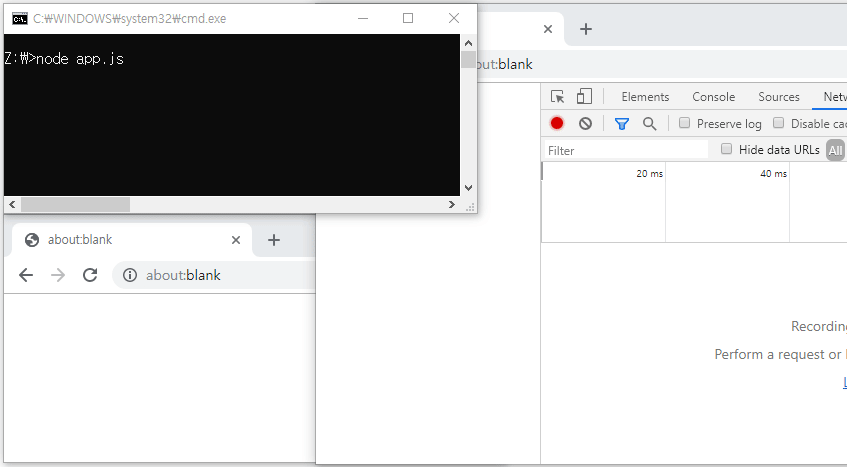

# Long-Polling-Example
Here is a simple long-polling example implemented as a Node.JS.

Node.JS로 구현한 간단한 롱폴링 예제입니다.

I implemented just HTTP without express.
But with simple modifications, you can use it with Express.

# Run
`npm start` or `node app.js`

# Demo

# License
Public-Domain